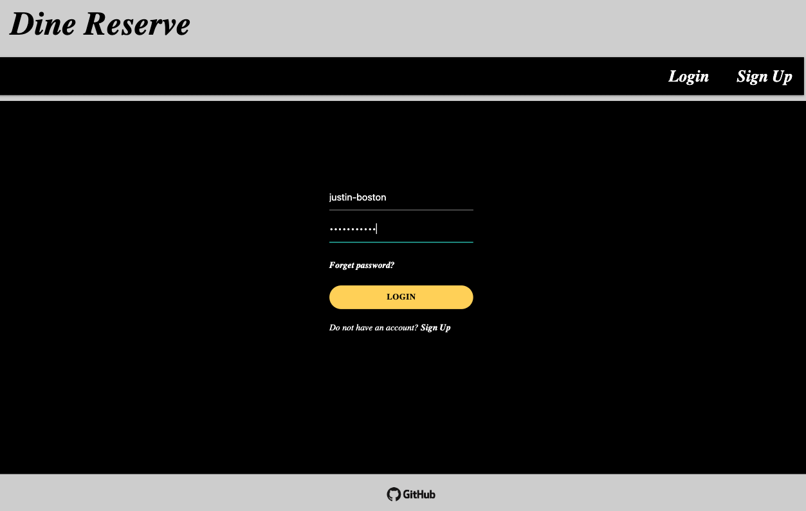
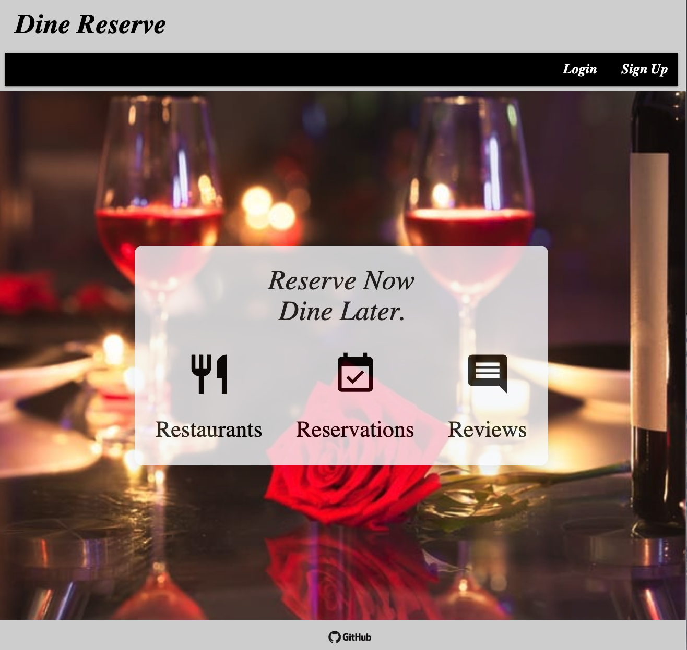
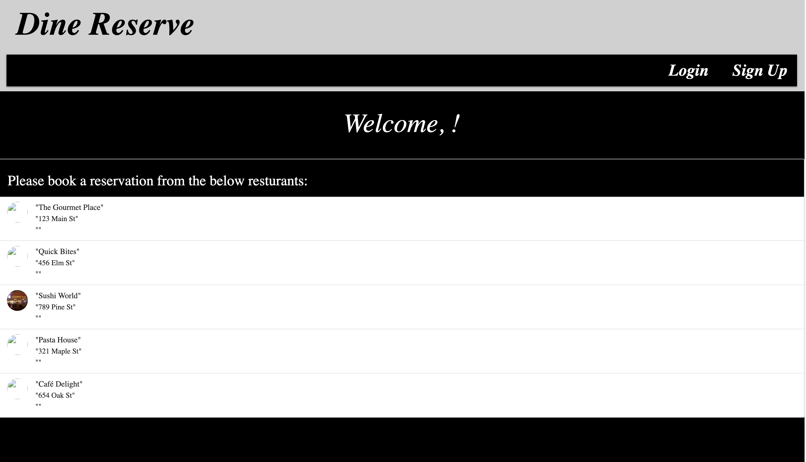
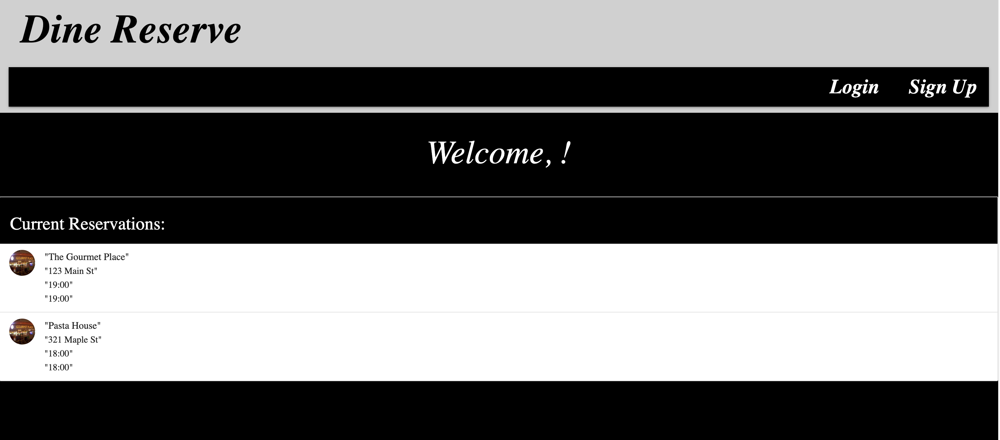

# DINE RESERVE

## Description

For this full stack bootcamp project, our team was tasked with creating a real-world full-stack application that satisfies the below acceptance criteria. 
<ul>
<li>Uses Node.js and Express.js to create a RESTful API.</li>
<li>Uses Handlebars.js as the template engine.</li>
<li>Uses PostgreSQL and the Sequelize ORM for the database. </li>
<li>Has both GET and POST routes for retrieving and adding new data.</li>
<li>Has a folder structure that meets the MVC paradigm.</li>
<li>Includes authentication (user login)</li>
<li>Deployed using Render</li>
<li>Has a polished & interactive UI.</li>
</ul>

## Concept

Welcome to Dine Reserve, the ultimate solution for efficient dining reservations! At Dine Reserve, we’ve created a smooth reservation system, so that you can book your perfect dining spot at the touch of your fingertips. With features like real-time table availability, we help you save time so that you can enjoy your meal. Dine Easy, Dine Reserve.

## User Story

AS a food lover who loves to enjoy various dining experiences
I WANT to browse local restaurants and book a reservation
SO that when I dine out with a party, it eases our experience by pre-booking a reservation.

## Usage

To utilize the DINE RESERVE application, please first login

Once logged in, please select the 'Restaurants' icon from the homepage to view available restuarants to dine at.

Once a restaurant and available dining time is selected, your reservation should save under the 'Reservations' page as a reminder.

## Technologies Used

<ul>
<li>Node.js </li>
<li>Express.js</li>
<li><a href="http://materializecss.com">Materialize CSS</a></li>
<li>JavaScript</li>
<li>PostgreSQL</li>
<li>Sequelize</li>
<li>Handlebars.js</li>
<li><a href="http://materializecss.com">Render</a></li>
<li>Git and GitHub</li>
</ul>

## Screenshots

## Links

<ul>
<li><a href="https://dine-reserve.onrender.com/">Deployed Dine Reserve Application</a></li>
<li><a href="https://github.com/justinboston/dine-reserve">GitHub Repo</a></li>
</ul>

# Contributors

<ul>
<li><a href="https://github.com/justinboston">Justin Boston</a></li>
<li><a href="https://github.com/UmmulColumbia">Ummul Mukta</a></li>
<li><a href="https://github.com/Igimbayeva">Dinara Igimbayeva</a></li>
<li><a href="https://github.com/kamranana">Ana Kamran</a></li>
</ul>

## Liscense

